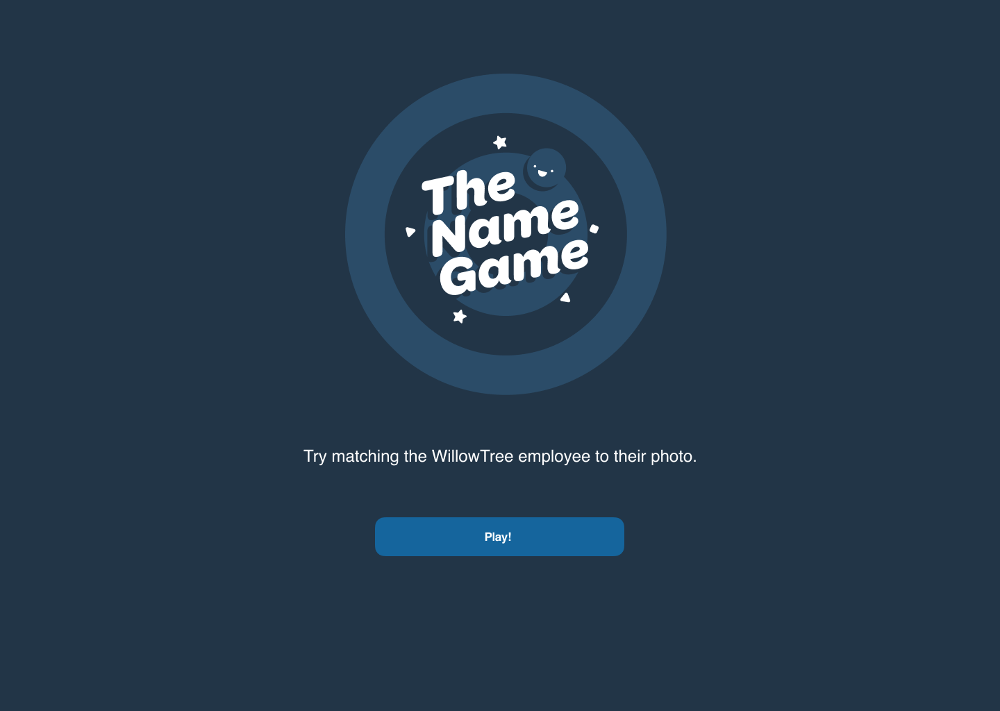

# The Namegame for Web

Leading scientists have proven, via science, that learning your coworkers names while starting a new job is useful. Your test project is to make it happen!

## Your mission

1. Use this [JSON API](https://willowtreeapps.com/api/v1.0/profiles/), which returns a list of employees along with their headshots, as a datasource for the game. A swagger spec for this API will be created soon to use as a reference.

2. Use [these Figma designs](https://www.figma.com/file/yUzRfmltt1m1UT9UkKL3y6/namegame?node-id=134%3A1026) as a reference for your implementation of the game. Try to match these designs as closely as possible. All assets can be exported from Figma directly following these  [instructions](https://help.figma.com/hc/en-us/articles/360040028114-Getting-Started-with-Exports).

3. Clicking “Start Game” on the menu screen will navigate to a new page or route showing the game screen. On the game screen, the game will select 6 employees at random from the list of employees and display their headshots in random order. Out of the 6, the name of one of those random employees will appear at the top.

4. The user must select the headshot that belongs to that person. If they guess correct, a message will display saying “Correct!” and a new 6 random employees will be displayed along with another name.

5. This will continue until a user correctly guesses 5 times. They are then taken to a stats screen which displays the number of correct and incorrect guesses. The user can select the “home” button which takes them back to the splash screen.

6. You can implement this app however you choose, that said, your Name Game test project will be evaluated according to [this rubric](namegame_web_evaluation_rubric.pdf). 
